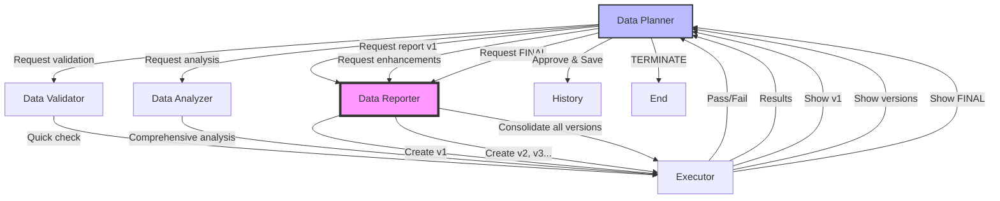

# Physics Evolution - Automated EDA System

An intelligent, multi-agent system for automated Exploratory Data Analysis (EDA) specialized in scientific machine learning and reduced order modeling. Built with **AG2** (AutoGen v2), the system learns from past analyses and continuously improves its insights.

## 🚀 Features

- **Multi-Agent Architecture**: Five specialized agents collaborate using AG2 framework
- **Historical Learning**: System learns from past analyses to improve future insights
- **Scientific Focus**: Optimized for physics simulations and scientific computing datasets
- **Automatic Versioning**: All code and reports are versioned to prevent overwrites
- **Tool Integration**: Agents use specialized tools for file management and history tracking

## 📊 Example Dataset

The included Burgers equation dataset (`burgers_data_R10.mat`) is from:

> **Source**: [A physics-informed variational DeepONet for predicting crack path in quasi-brittle materials](https://www.sciencedirect.com/science/article/abs/pii/S0045782522001207)  
> *Computer Methods in Applied Mechanics and Engineering*, Volume 391, 2022  
> DOI: 10.1016/j.cma.2022.114587

This dataset contains high-fidelity solutions of the 1D viscous Burgers equation, commonly used for:
- Testing reduced order modeling techniques
- Validating physics-informed neural networks
- Benchmarking scientific machine learning methods

## 📋 Prerequisites

- Python 3.8+
- Azure OpenAI API access
- AG2 (AutoGen v2) framework
- Required Python packages:
  ```bash
  pip install ag2 python-dotenv numpy scipy matplotlib seaborn pandas
  ```

  Or install from requirements.txt:
  ```bash
  pip install -r requirements.txt
  ```

## 🛠️ Setup

1. **Clone the repository**:
   ```bash
   git clone <repository-url>
   cd physics_evo
   ```

2. **Configure Azure OpenAI**:
   - Copy `.env.example` to `.env`
   - Fill in your Azure OpenAI credentials:
     ```env
     AZURE_OPENAI_API_KEY=your_api_key_here
     AZURE_OPENAI_API_VERSION=2024-02-15-preview
     AZURE_OPENAI_ENDPOINT=https://your-resource.openai.azure.com/
     AZURE_OPENAI_MODEL=gpt-4
     ```

3. **Verify directory structure** (automatically created on first run):
   ```
   physics_evo/
   ├── eda/
   │   ├── code/        # Versioned analysis code
   │   ├── figures/     # Generated visualizations
   │   ├── stats/       # Statistical outputs
   │   ├── reports/     # Final reports
   │   └── history/     # Historical analyses
   ├── data/            # Your data files
   └── *.py             # System files
   ```

## 🎯 Usage

### Basic Usage

Run EDA on a data file:
```bash
python eda_system.py data/your_file.mat
```

Or use the default example:
```bash
python eda_system.py
```

### Supported File Types

- `.mat` - MATLAB files (optimized for scientific data)
- `.csv` - Comma-separated values
- `.json` - JSON structured data
- `.npy/.npz` - NumPy arrays

## 🤖 Agent Roles

### 1. **Data Planner** (Strategic Coordinator)
- Loads similar past analyses for learning
- Coordinates the entire multi-phase workflow
- **Delegates report writing to data_reporter**
- Reviews and iterates on reports
- Saves final analyses to history
- Makes decisions on additional analysis needs
- Specializes in scientific machine learning and ROM

### 2. **Data Validator** (Quality Gatekeeper)
- **Lightweight validation only** - no heavy computation
- Performs quick checks:
  * File exists and is readable
  * Data can be loaded without errors
  * Basic structure validation (not corrupted)
  * Identifies critical issues
- Returns simple pass/fail status
- **Does NOT** compute statistics or create visualizations
- Typical script: <50 lines focused on data integrity

### 3. **Data Analyzer** (Analysis Powerhouse)
- **Handles ALL analytical work** in one comprehensive script
- Performs multi-phase analysis:
  * **Phase 1**: Basic statistics (min, max, mean, std, outliers)
  * **Phase 2**: Advanced analysis (correlations, spectral analysis)
  * **Phase 3**: Visualizations (histograms, heatmaps, scatter plots)
  * **Phase 4**: Save all results to appropriate directories
- Creates single `eda_analysis.py` that does everything
- Outputs to `stats/statistics.json` with both basic and advanced metrics
- Generates all visualization figures

### 4. **Data Reporter** (Technical Writer)
- **Creates comprehensive reports** from analysis outputs
- Reads statistics JSON and synthesizes findings
- Writes structured markdown reports with:
  * Executive summary
  * Statistical tables
  * Advanced analysis insights
  * Visualization descriptions
  * Key findings and recommendations
- Responds to planner's revision requests
- Creates both markdown and JSON report formats
- Ensures accuracy by using exact values from statistics.json

### 5. **Executor** (Code Runner)
- Executes all code safely with timeout protection
- Routes results to appropriate agents
- Shows validation status (pass/fail) to planner
- Displays full statistics after analysis
- Confirms report saves and shows previews
- Handles error recovery and routing

## 📊 Output Structure

After analysis, you'll find:

```
eda/
├── code/
│   ├── quick_validation_v1.py    # Lightweight validation
│   ├── eda_analysis_v1.py        # Comprehensive analysis
│   ├── save_reports_v*.py        # Report generation scripts
│   └── save_final_report_v*.py   # Final consolidation script
├── stats/
│   └── statistics.json           # Complete statistics
├── figures/
│   └── *.png                      # All visualizations
├── reports/                       # VERSIONED & CONSOLIDATED REPORTS
│   ├── data_report_v1.md         # Initial report
│   ├── data_report_v2.md         # First enhancement
│   ├── data_report_v3.md         # Further refinements
│   ├── data_report_FINAL.md      # CONSOLIDATED FINAL REPORT
│   ├── data_report_FINAL_[timestamp].md  # Archived final
│   └── *.json                     # JSON versions
└── history/
    └── *_report.md                # Historical reports
```

### Report Evolution & Consolidation

The system follows an **iterative enhancement** approach culminating in a final consolidated report:

#### Iteration Phase
1. **Version 1**: Initial comprehensive analysis
2. **Version 2+**: Progressive enhancements based on review feedback
3. Each version builds upon previous insights

#### Final Consolidation
After all iterations, the system creates a **FINAL CONSOLIDATED REPORT** that:
- Merges all analyses from every iteration
- Shows the evolution of insights
- Preserves all findings without duplication
- Creates a coherent narrative of the analysis journey

**Example Final Report Structure**:
```markdown
# FINAL CONSOLIDATED DATA REPORT

## Analysis Evolution
### Version 1 - Initial Analysis
- Basic statistics computed
- Initial patterns identified

### Version 2 - Enhanced Analysis
- Added correlation analysis
- Discovered spectral characteristics

### Version 3 - Deep Dive
- Gradient analysis for shock detection
- Physics-based insights

## Consolidated Findings
[All findings merged and organized]
```

## 📊 Workflow Architecture



### Benefits of Report Consolidation:
- **Complete Analysis Trail**: See how understanding evolved
- **No Lost Insights**: All discoveries preserved
- **Clear Progression**: Understand what each iteration added
- **Final Synthesis**: Coherent narrative from all analyses
- **Quality Assurance**: Final review ensures completeness

## 🧪 Testing & Validation

### Manual EDA Validation Script

A standalone validation script `run_full_eda_burgers_R10.py` is provided to verify the agentic system's results:

```bash
# Run manual analysis for comparison
python run_full_eda_burgers_R10.py
```

This creates an `output/eda/` directory with:
- `summary.txt` - Human-readable statistics
- `summary.json` - JSON format statistics
- `statistics.csv` - CSV format for spreadsheet analysis
- `plots/` - Visualization plots for each variable

**Use this to validate:**
- Statistical calculations match between systems
- All variables are properly detected
- Visualizations are correctly generated
- No data is lost or misinterpreted

### Comparing Results

After running both the agentic system and manual validation:

```bash
# Agentic system results (comprehensive with both basic and advanced stats)
cat eda/stats/statistics.json

# Manual validation results  
cat output/eda/summary.json

# Compare specific statistics
python -c "
import json
with open('eda/stats/statistics.json') as f1, open('output/eda/summary.json') as f2:
    agent_stats = json.load(f1)
    manual_stats = json.load(f2)
    # Compare basic stats
    print('Agent basic stats:', agent_stats.get('basic_stats', {}))
    print('Manual stats:', manual_stats.get('statistical_analysis', {}))
    # Check advanced stats (only in agent system)
    print('Agent advanced stats available:', 'advanced_stats' in agent_stats)
"
```

## 🔧 Advanced Features

### Five-Agent Collaborative System

The system uses specialized agents working in concert:

1. **Planner** orchestrates and reviews
2. **Validator** ensures data integrity
3. **Analyzer** performs all computations
4. **Reporter** creates documentation
5. **Executor** runs code safely

This separation ensures:
- Clear responsibilities
- No duplicate work
- High-quality outputs
- Iterative improvement
- Comprehensive analysis

### Two-Phase Analysis System

The analyzer now performs comprehensive analysis in phases:

1. **Basic Statistics Phase**:
   - Descriptive statistics (min, max, mean, std, median)
   - Quartiles and IQR
   - Outlier detection (z-score > 3)
   - Missing value analysis

2. **Advanced Analysis Phase**:
   - Pearson/Spearman correlations
   - Spectral analysis (FFT, power spectrum)
   - Gradient analysis for physics simulations
   - Pattern detection and anomalies

3. **Visualization Phase**:
   - Distribution plots
   - Correlation matrices
   - Spectral plots
   - Physics-specific visualizations

### Validation as Quality Gate

The validator acts as a gatekeeper:
- Quick file integrity check
- No heavy computation
- Simple pass/fail decision
- Prevents wasted computation on bad data

### Historical Learning

The system maintains a history of all analyses:
- Learns common patterns for file types
- Suggests analyses based on past success
- Improves insights over time

### Tool System

Agents use registered tools:
- `save_code_file()` - Version-controlled code saving
- `load_similar_analyses()` - Learn from history
- `load_current_reports()` - Review current reports
- `save_analysis_to_history()` - Archive analyses
- `get_historical_insights()` - Get past insights

### Workflow Customization

Modify agent behaviors in `eda_system.py`:
- Adjust statistical thresholds
- Change visualization preferences
- Add domain-specific analyses
- Modify report templates

### Validation Tools

The system includes validation capabilities:
- **Manual EDA Script**: `run_full_eda_burgers_R10.py` for ground truth comparison
- **Statistics Verification**: Compare JSON outputs between systems
- **Visual Inspection**: Side-by-side plot comparison
- **Consistency Checks**: Built-in variable name verification

## 🎓 Scientific Computing Features

Optimized for:
- **High-dimensional data**: Aggregate statistics for arrays with >100 columns
- **Physics simulations**: Burgers equation, Navier-Stokes, etc.
- **Reduced Order Modeling**: POD/PCA readiness assessment
- **Shock detection**: Identifies discontinuities in solutions
- **Multi-fidelity data**: Correlations between resolution levels

## 🐛 Troubleshooting

### Common Issues

1. **Missing dependencies**:
   ```bash
   pip install scipy matplotlib seaborn
   ```

2. **Azure OpenAI errors**:
   - Verify `.env` configuration
   - Check API key and endpoint
   - Ensure model deployment exists

3. **File not found**:
   - Use relative paths from project root
   - Check file exists before running

4. **Memory issues** with large files:
   - System uses aggregate statistics for large arrays
   - Consider data chunking for very large files

5. **Verifying statistics accuracy**:
   ```bash
   # Run manual validation
   python run_full_eda_burgers_R10.py
   
   # Compare with agent results
   diff eda/stats/statistics.json output/eda/summary.json
   ```

6. **Discrepancies in results**:
   - Check data loading paths
   - Verify preprocessing steps
   - Compare aggregation methods (per-column vs. overall)
   - Review outlier detection thresholds

7. **Agent role confusion**:
   - Validator: Only checks if data is loadable
   - Analyzer: Does ALL analysis work
   - If validator is computing stats, the system needs updating

8. **Duplicate analysis**:
   - System now uses single `eda_analysis.py` for all work
   - No more separate validation and analysis statistics
   - Check `eda/code/` for script versions

9. **Report quality issues**:
   - Data Reporter reads from `stats/statistics.json`
   - Ensure analysis completes before report generation
   - Check JSON structure matches expected format
   - Planner can request specific revisions

10. **Report versioning issues**:
    - Check `reports/` directory for all versions
    - Latest report is always in `data_report_latest.md`
    - Each version builds upon the previous
    - If version numbers are skipped, check for errors in save script

11. **Lost report content**:
    - All report versions are preserved
    - Check `reports/data_report_v*.md` for all versions
    - History directory also maintains copies
    - No content is ever overwritten, only enhanced

12. **Final report consolidation**:
    - Check `reports/data_report_FINAL.md` for consolidated report
    - Review `reports/data_report_v*.md` for individual versions
    - Final report should include analysis evolution section
    - Archive copies saved with timestamp for multiple runs

## 📈 Example Outputs

### Validation Report
```json
{
  "variables": {
    "a": {
      "shape": [2048, 8192],
      "dtype": "float64",
      "nan_count": 0,
      "memory_bytes": 134217728
    }
  }
}
```

### Statistical Analysis
```json
{
  "a": {
    "mean": 0.0,
    "std": 0.589,
    "min": -2.296,
    "max": 2.665,
    "outliers_z3": 42706
  }
}
```

## 🤝 Contributing

Contributions are welcome! Areas for improvement:
- Additional file type support
- More visualization types
- Enhanced pattern detection
- Domain-specific analyses

## 📄 License

[Your License Here]

## 📚 References

1. **Burgers Equation Dataset**: [Goswami et al. (2022)](https://www.sciencedirect.com/science/article/abs/pii/S0045782522001207). A physics-informed variational DeepONet for predicting crack path in quasi-brittle materials. *Computer Methods in Applied Mechanics and Engineering*, 391, 114587.

2. **AG2 Framework**: [AG2 (AutoGen v2)](https://github.com/ag2ai/ag2) - Multi-agent conversation framework

3. **Azure OpenAI**: [Azure OpenAI Service](https://azure.microsoft.com/en-us/products/ai-services/openai-service) - Enterprise AI models

## 🙏 Acknowledgments

- Built with [AG2 (AutoGen v2)](https://github.com/ag2ai/ag2)
- Powered by Azure OpenAI
- Example data courtesy of [Goswami et al. (2022)](https://www.sciencedirect.com/science/article/abs/pii/S0045782522001207)
- Optimized for scientific computing workflows

## 📞 Support

For issues or questions:
- Open an issue on GitHub
- Check existing history reports for similar analyses
- Review agent logs for debugging

---

**Note**: This system uses a five-agent collaborative approach where each agent has a specialized role. The Data Reporter ensures high-quality documentation by focusing solely on creating comprehensive, accurate reports from analysis outputs.
