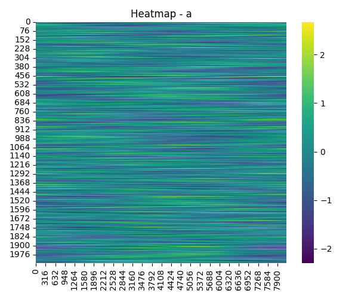
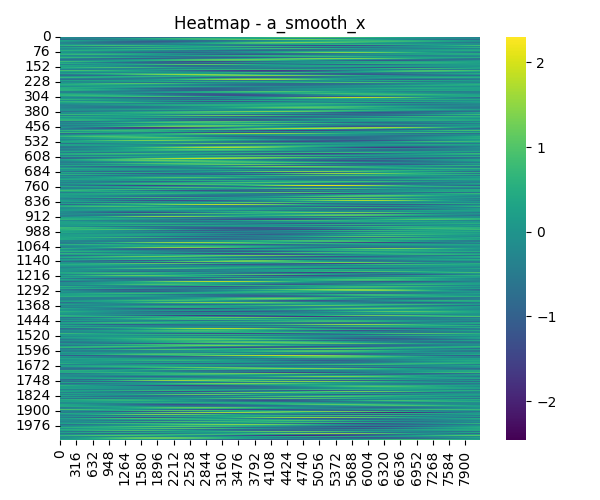
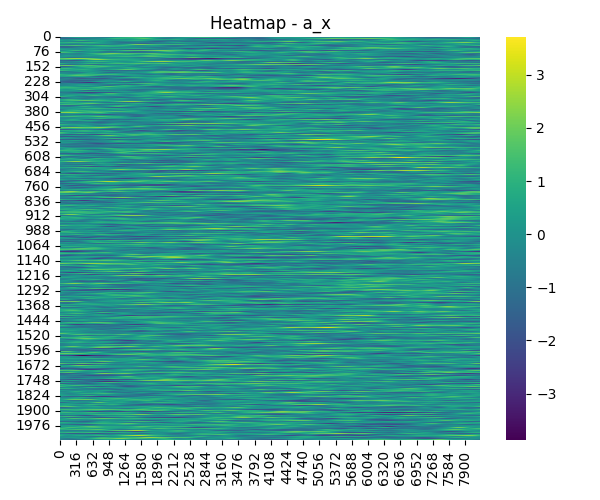
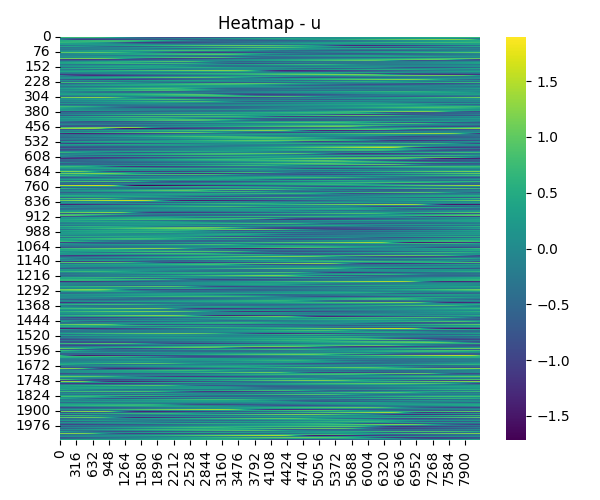
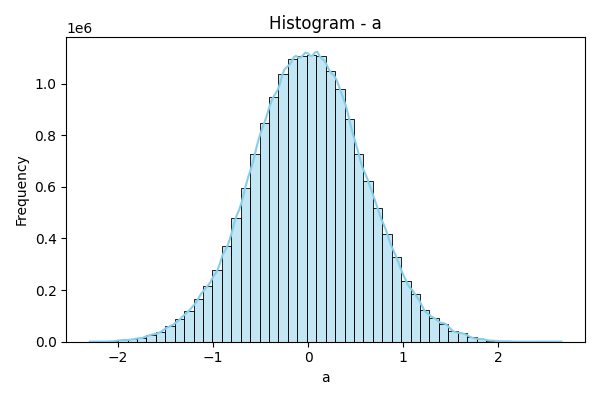
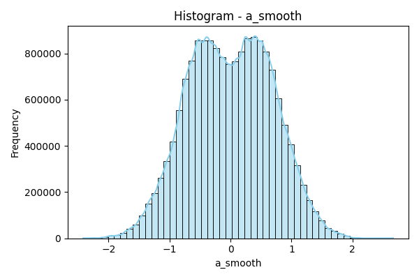
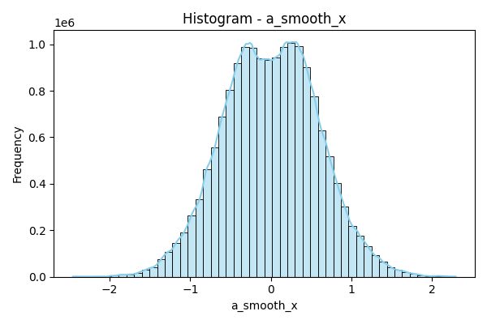
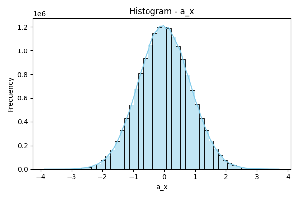
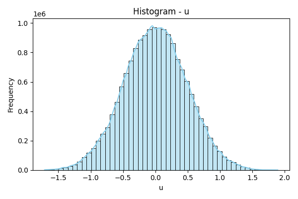

# Data Report – Version 3

_Generated: 2025-10-30T15:59:17.302051_

## Executive Summary

This report presents descriptive statistics, advanced analyses, and visual insights derived from the latest data processing run.

## Basic Statistics

### Variable: a

* **shape**: [2048, 8192]
* **min**: -2.2962219556221997
* **max**: 2.6648084568058166
* **mean**: 1.2273507405714812e-18
* **std**: 0.5894236785943832
* **median**: -0.0009560134173722101
* **q25**: -0.3955294951944736
* **q75**: 0.3930350437628014
* **missing_values**: 0
* **total_values**: 16777216
* **outliers_z3**: 42706
* **skewness**: 1.411349614041929e-05
* **kurtosis**: 0.028943738214404657

### Variable: a_smooth

* **shape**: [2048, 8192]
* **min**: -2.4162676072664273
* **max**: 2.6648084568058166
* **mean**: -0.0018948705093323203
* **std**: 0.6838017639077401
* **median**: 0.000353596025666053
* **q25**: -0.5193752098705244
* **q75**: 0.5145815139692029
* **missing_values**: 0
* **total_values**: 16777216
* **outliers_z3**: 9327
* **skewness**: -0.01368304998033045
* **kurtosis**: -0.5124054911187264

### Variable: a_smooth_x

* **shape**: [2048, 8191]
* **min**: -2.4572442863495287
* **max**: 2.296045528323745
* **mean**: -0.0006070458971161119
* **std**: 0.5872798354617047
* **median**: 0.0018368198722567048
* **q25**: -0.41291164615083376
* **q75**: 0.40854538241531724
* **missing_values**: 0
* **total_values**: 16775168
* **outliers_z3**: 41848
* **skewness**: 0.014102513679106763
* **kurtosis**: -0.10529909087369482

### Variable: a_x

* **shape**: [2048, 8191]
* **min**: -3.869180391851075
* **max**: 3.7105510409101607
* **mean**: 9.382002407729036e-07
* **std**: 0.838872445313132
* **median**: -0.005797237567652953
* **q25**: -0.5678592369897231
* **q75**: 0.563828027505304
* **missing_values**: 0
* **total_values**: 16775168
* **outliers_z3**: 48959
* **skewness**: 0.033164855746360355
* **kurtosis**: 0.025050342050337626

### Variable: u

* **shape**: [2048, 8192]
* **min**: -1.7130569022253612
* **max**: 1.8928327999912824
* **mean**: -3.358485635863301e-19
* **std**: 0.4879947836067884
* **median**: 0.00022614627658654185
* **q25**: -0.33133175103264856
* **q75**: 0.3295171024423057
* **missing_values**: 0
* **total_values**: 16777216
* **outliers_z3**: 28222
* **skewness**: -0.0038000862972801227
* **kurtosis**: -0.0809023634743018

## Advanced Analysis

### Gradient Analysis

* **a** – min: 1.6350025851151666e-06, max: 1.952002718978861, mean: 0.33553840134129

* **a_smooth** – min: 9.076681217614918e-06, max: 1.9523823074765918, mean: 0.3934984117481358

* **a_smooth_x** – min: 2.385674028322959e-06, max: 1.8507034478023725, mean: 0.3314098361133568

* **a_x** – min: 1.2035643774479234e-05, max: 3.0020817075833963, mean: 0.47616176826477336

* **u** – min: 4.984129447646141e-06, max: 1.4664302330779966, mean: 0.27854313932742253

## Visualizations

## Appendix: Figure List

| # | Filename | Description |
|---|----------|-------------|
| 1 | heatmap_a.png | Heatmap A |
| 2 | heatmap_a_smooth.png | Heatmap A Smooth |
| 3 | heatmap_a_smooth_x.png | Heatmap A Smooth X |
| 4 | heatmap_a_x.png | Heatmap A X |
| 5 | heatmap_u.png | Heatmap U |
| 6 | hist_a.png | Hist A |
| 7 | hist_a_smooth.png | Hist A Smooth |
| 8 | hist_a_smooth_x.png | Hist A Smooth X |
| 9 | hist_a_x.png | Hist A X |
| 10 | hist_u.png | Hist U |